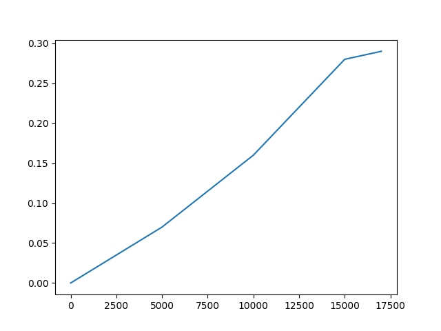

# word2vec-Cython
Python implementation word2vec with Hierarchical Softmax

## Result
Model train on 100mb Text8 corpus.

- Eval on questions-words.txt [link](https://github.com/nicholas-leonard/word2vec/blob/master/questions-words.txt)
